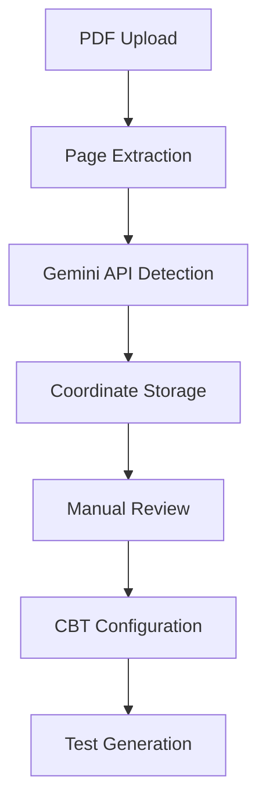

# Advanced Diagram Detection System

A comprehensive PDF processing system with AI-powered diagram detection using Google Gemini API, featuring coordinate-based rendering, accessibility support, and responsive design.

## 🚀 Features

### Core Features
- **AI-Powered Diagram Detection**: Uses Google Gemini API for precise diagram coordinate detection
- **Coordinate-Based Rendering**: Dynamic diagram display without separate image files
- **Manual Review Interface**: Interactive editing and validation of detected diagrams
- **CBT Preset Engine**: Predefined configurations for JEE and NEET examinations
- **Data Migration Tools**: Convert existing cropped images to coordinate-based format

### Accessibility Features
- **WCAG 2.1 AA Compliance**: Full accessibility support for users with disabilities
- **Screen Reader Support**: Comprehensive ARIA labels and live announcements
- **Keyboard Navigation**: Complete keyboard accessibility with shortcuts
- **High Contrast Mode**: Enhanced visibility options
- **Font Size Scaling**: Adjustable text sizes from small to extra-large

### Responsive Design
- **Mobile-First Design**: Optimized for all device types and screen sizes
- **Touch Optimization**: 44px minimum touch targets and gesture support
- **Fluid Typography**: Scalable text that adapts to viewport size
- **Container Queries**: Element-based responsive behavior
- **Performance Optimized**: Lazy loading and image compression

## 📋 Prerequisites

- **Node.js**: Version 18.0.0 or higher
- **npm**: Version 8.0.0 or higher
- **Gemini API Key**: Required for diagram detection ([Get API Key](https://makersuite.google.com/app/apikey))

## 🛠️ Installation

### 1. Clone the Repository

```bash
git clone https://github.com/your-org/advanced-diagram-detection.git
cd advanced-diagram-detection
```

### 2. Install Dependencies

```bash
npm install
```

### 3. Environment Configuration

```bash
# Copy the example environment file
cp .env.example .env

# Edit the .env file and add your Gemini API key
NUXT_PUBLIC_GEMINI_API_KEY=your_gemini_api_key_here
```

### 4. Development Server

```bash
# Start the development server
npm run dev

# The application will be available at http://localhost:3000
```

## 🐳 Docker Deployment

### Development with Docker

```bash
# Build and run development environment
docker-compose --profile dev up --build
```

### Production with Docker

```bash
# Build and run production environment
docker-compose up --build

# With additional services (nginx, redis, monitoring)
docker-compose --profile production --profile cache --profile monitoring up --build
```

### Docker Commands

```bash
# Build Docker image
npm run docker:build

# Run Docker container
npm run docker:run

# View logs
docker-compose logs -f app

# Stop services
docker-compose down
```

## 🔧 Configuration

### Environment Variables

The system uses environment variables for configuration. Key variables include:

```bash
# API Configuration
NUXT_PUBLIC_GEMINI_API_KEY=your_api_key
NUXT_PUBLIC_API_TIMEOUT=30000
NUXT_PUBLIC_MAX_RETRIES=3

# Processing Configuration
NUXT_PUBLIC_CONFIDENCE_THRESHOLD=0.7
NUXT_PUBLIC_BATCH_SIZE=5
NUXT_PUBLIC_ENABLE_AUTO_DETECTION=true

# Performance Configuration
NUXT_PUBLIC_ENABLE_LAZY_LOADING=true
NUXT_PUBLIC_ENABLE_IMAGE_COMPRESSION=true
NUXT_PUBLIC_MAX_IMAGE_SIZE=10485760

# Accessibility Configuration
NUXT_PUBLIC_ENABLE_ACCESSIBILITY=true
NUXT_PUBLIC_DEFAULT_FONT_SIZE=medium
NUXT_PUBLIC_DEFAULT_COLOR_SCHEME=light
```

### Runtime Configuration

The application includes a built-in configuration panel accessible through the UI. Users can:

- Configure API settings and model selection
- Adjust processing parameters
- Customize accessibility options
- Set performance preferences
- Export/import configuration files

## 📚 Usage

### Basic PDF Processing

```typescript
import { useDiagramDetection } from '~/composables/useDiagramDetection'

const { processPDF, state } = useDiagramDetection({
  confidenceThreshold: 0.8,
  enableAutoDetection: true
})

// Process a PDF file
const questions = await processPDF(pdfFile)

// Monitor progress
console.log(`Progress: ${state.value.progress}%`)
console.log(`Detected diagrams: ${state.value.detectedDiagrams.length}`)
```

### Manual Review Interface

```vue
<template>
  <DiagramReviewInterface
    :questions="questions"
    :page-images="pageImages"
    @diagram-updated="handleDiagramUpdate"
    @diagram-deleted="handleDiagramDelete"
  />
</template>
```

### Accessibility Integration

```vue
<template>
  <AccessibilityProvider :initial-config="accessibilityConfig">
    <YourAppContent />
  </AccessibilityProvider>
</template>

<script setup>
const accessibilityConfig = {
  fontSize: 'medium',
  colorScheme: 'light',
  enableScreenReader: true,
  enableKeyboardNavigation: true
}
</script>
```

## 🧪 Testing

### Unit Tests

```bash
# Run unit tests
npm run test

# Run tests with coverage
npm run test:coverage

# Run tests in watch mode
npm run test -- --watch
```

### End-to-End Tests

```bash
# Run E2E tests
npm run test:e2e

# Run E2E tests in headed mode
npm run test:e2e -- --headed
```

### Test Structure

```
apps/shared/app/__tests__/
├── accessibility/           # Accessibility feature tests
├── components/             # Vue component tests
├── integration/            # Integration tests
├── unit/                   # Unit tests
├── visual/                 # Visual regression tests
└── e2e/                    # End-to-end tests
```

## 🏗️ Architecture

### System Components

1. **PDF Processing Pipeline**: Enhanced MuPDF integration with coordinate detection
2. **Gemini API Client**: Client-side integration for diagram detection
3. **Coordinate Management**: Storage and manipulation of bounding box data
4. **Manual Review Interface**: Interactive editing of diagram coordinates
5. **CBT Preset Engine**: Predefined configurations for examinations
6. **Accessibility Manager**: WCAG compliance and assistive technology support
7. **Responsive Design Manager**: Breakpoint management and adaptive layouts

### Data Flow



### Technology Stack

- **Frontend**: Vue.js 3, Nuxt.js 3, TypeScript
- **AI Integration**: Google Gemini API
- **Storage**: IndexedDB (Dexie.js)
- **PDF Processing**: PDF.js (MuPDF)
- **Testing**: Vitest, Playwright
- **Styling**: CSS3, Tailwind CSS
- **Build**: Vite, Rollup

## 🔐 Security

### API Key Management

- API keys are stored securely in local storage
- Environment variables for server-side configuration
- No sensitive data transmitted to external services
- Client-side encryption for stored coordinates

### Data Privacy

- All processing happens client-side
- No PDF content sent to external servers
- Coordinate data stored locally in IndexedDB
- Optional data export with user consent

## 🚀 Performance

### Optimization Features

- **Lazy Loading**: Images and coordinates loaded on demand
- **Caching**: Intelligent caching of frequently accessed data
- **Image Compression**: Optimized image storage and transmission
- **Batch Processing**: Multiple diagrams processed efficiently
- **Code Splitting**: Dynamic imports for better loading performance

### Performance Monitoring

```typescript
// Enable performance monitoring
const config = {
  enablePerformanceMonitoring: true,
  enableDebugMode: true
}
```

## ♿ Accessibility

### WCAG 2.1 AA Compliance

- **Keyboard Navigation**: Full keyboard accessibility
- **Screen Reader Support**: Comprehensive ARIA implementation
- **Color Contrast**: High contrast mode available
- **Font Scaling**: Adjustable text sizes
- **Motion Preferences**: Respects reduced motion settings

### Keyboard Shortcuts

| Shortcut | Action |
|----------|--------|
| `Alt + 1` | Skip to main content |
| `Alt + 2` | Skip to navigation |
| `Alt + 3` | Skip to search |
| `Escape` | Close dialogs |
| `F6` | Cycle focus groups |
| `Ctrl + /` | Show keyboard shortcuts |

## 📱 Responsive Design

### Breakpoints

- **xs**: 0-575px (Mobile Portrait)
- **sm**: 576-767px (Mobile Landscape)
- **md**: 768-991px (Tablet)
- **lg**: 992-1199px (Desktop)
- **xl**: 1200-1399px (Large Desktop)
- **xxl**: 1400px+ (Extra Large Desktop)

### Touch Optimization

- Minimum 44px touch targets
- Gesture support for diagram interaction
- Optimized scrolling and navigation
- Touch-friendly interface elements

## 🔧 Development

### Project Structure

```
apps/shared/app/
├── assets/                 # Static assets and styles
├── components/             # Vue components
├── composables/            # Vue composables
├── middleware/             # Nuxt middleware
├── pages/                  # Application pages
├── plugins/                # Nuxt plugins
├── types/                  # TypeScript type definitions
├── utils/                  # Utility functions
└── __tests__/              # Test files
```

### Code Quality

```bash
# Lint code
npm run lint

# Fix linting issues
npm run lint:fix

# Type checking
npm run type-check

# Bundle analysis
npm run analyze
```

### Git Hooks

The project includes pre-commit hooks for:
- Code linting
- Type checking
- Test execution
- Commit message validation

## 📖 API Reference

### Composables

#### `useDiagramDetection`

```typescript
const {
  state,           // Reactive processing state
  processPDF,      // Process PDF with diagram detection
  updateDiagramCoordinates, // Update diagram coordinates
  deleteDiagram,   // Delete a diagram
  exportData,      // Export processed data
  importData       // Import processed data
} = useDiagramDetection(config)
```

#### `useAccessibility`

```typescript
const {
  announce,        // Announce message to screen readers
  updateConfig,    // Update accessibility configuration
  getState        // Get current accessibility state
} = useAccessibility()
```

### Components

#### `<DiagramDetectionProvider>`

Main provider component with configuration panel.

```vue
<DiagramDetectionProvider
  :show-status-bar="true"
  :show-config-on-mount="false"
>
  <YourContent />
</DiagramDetectionProvider>
```

#### `<AccessibilityProvider>`

Accessibility wrapper component.

```vue
<AccessibilityProvider :initial-config="config">
  <YourContent />
</AccessibilityProvider>
```

#### `<ResponsiveDiagramOverlay>`

Responsive diagram overlay component.

```vue
<ResponsiveDiagramOverlay
  :coordinates="coordinates"
  :page-width="800"
  :page-height="600"
  :editable="true"
  @click="handleClick"
/>
```

## 🐛 Troubleshooting

### Common Issues

#### API Key Not Working

```bash
# Check if API key is set
echo $NUXT_PUBLIC_GEMINI_API_KEY

# Verify API key in browser console
localStorage.getItem('gemini-api-key')
```

#### IndexedDB Issues

```javascript
// Check IndexedDB support
if ('indexedDB' in window) {
  console.log('IndexedDB supported')
} else {
  console.log('IndexedDB not supported')
}
```

#### Performance Issues

```bash
# Enable performance monitoring
NUXT_PUBLIC_ENABLE_PERFORMANCE_MONITORING=true npm run dev

# Check bundle size
npm run analyze
```

### Debug Mode

Enable debug mode for detailed logging:

```bash
NUXT_PUBLIC_ENABLE_DEBUG_MODE=true npm run dev
```

## 📄 License

This project is licensed under the MIT License - see the [LICENSE](LICENSE) file for details.

## 🤝 Contributing

1. Fork the repository
2. Create a feature branch (`git checkout -b feature/amazing-feature`)
3. Commit your changes (`git commit -m 'Add amazing feature'`)
4. Push to the branch (`git push origin feature/amazing-feature`)
5. Open a Pull Request

### Development Guidelines

- Follow TypeScript best practices
- Write comprehensive tests
- Ensure accessibility compliance
- Update documentation
- Follow semantic versioning

## 📞 Support

- **Documentation**: [GitHub Wiki](https://github.com/your-org/advanced-diagram-detection/wiki)
- **Issues**: [GitHub Issues](https://github.com/your-org/advanced-diagram-detection/issues)
- **Discussions**: [GitHub Discussions](https://github.com/your-org/advanced-diagram-detection/discussions)

## 🙏 Acknowledgments

- **Google Gemini API** for AI-powered diagram detection
- **Vue.js Team** for the excellent framework
- **Nuxt.js Team** for the powerful meta-framework
- **PDF.js Team** for PDF processing capabilities
- **Accessibility Community** for WCAG guidelines and best practices

## 📊 Project Status

- ✅ Core diagram detection functionality
- ✅ Accessibility features (WCAG 2.1 AA)
- ✅ Responsive design system
- ✅ Manual review interface
- ✅ Configuration management
- ✅ Docker deployment
- ✅ Comprehensive testing
- 🚧 CBT preset engine (in progress)
- 🚧 Performance optimizations (in progress)
- 📋 Advanced analytics (planned)

---

**Made with ❤️ by the Advanced Diagram Detection Team**