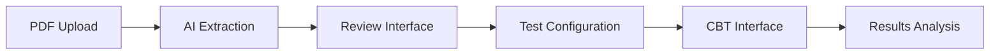
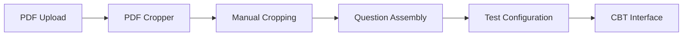

# 🎯 Rankify

> 🚀 **Transform Your PDF Question Papers into Interactive Mock Tests**<br>
> *The Ultimate CBT Platform for JEE & NEET Aspirants*

<p align="center">
  
  
  
  
</p>

---

## 🔥 Why Rankify?

**Tired of solving paper-based mock tests?** 📚→💻

Rankify converts your PDF question papers into **interactive, timed CBT** (Computer-Based Tests) that feel exactly like the real JEE/NEET exams!

### ⚡ **Instant Benefits for Students:**
- ⏱️ **Real Exam Experience** - Timed tests with real exam interface
- 📊 **Detailed Analytics** - Know your weak areas with precision
- 🎯 **Practice Anytime** - Convert any PDF into mock test instantly
- 📱 **Works Offline** - Practice without internet dependency
- 🤖 **AI-Powered** - Automatic question extraction (or manual if preferred)

---

## 🚀 Quick Start

### For JEE/NEET Students 🧠

1. **📤 Upload Your PDF** - Any question paper in PDF format
2. **🤖 AI Extraction** - Let AI extract questions automatically (or use manual cropper)
3. **⚙️ Configure Test** - Set timing, marking scheme, subjects
4. **🎮 Take Test** - Experience real exam-like interface
5. **📈 Analyze Results** - Get detailed performance insights

**✨ That's it!** Your PDF is now a full-fledged mock test!

---

## 🎯 Perfect for Competitive Exams

### **JEE (Main/Advanced) Students** 🏆
- **Physics, Chemistry, Mathematics** question papers
- **NAT (Numerical)** questions with exact answer matching
- **Mock tests** that simulate real JEE interface
- **Performance tracking** across multiple attempts

### **NEET Aspirants** 🩺
- **Biology, Physics, Chemistry** comprehensive coverage
- **MCQ/MSQ** practice with detailed explanations
- **Speed and accuracy** improvement tracking
- **Subject-wise analysis** for focused preparation

---

## 🌟 Key Features

### **📝 Question Types Supported**
- ✅ **MCQ** - Multiple Choice Questions (Single Correct)
- ✅ **MSQ** - Multiple Select Questions (Multiple Correct)
- ✅ **NAT** - Numerical Answer Type (Exact Values)
- ✅ **MSM** - Matrix Match Questions

### **🎛️ Advanced Test Interface**
- ⏰ **Real-time Timer** with pause/resume
- 🎯 **Question Palette** for quick navigation
- 🔖 **Mark for Review** functionality
- 💾 **Auto-save** progress
- 📊 **Live Statistics** (attempted, marked, remaining)

### **📊 Performance Analytics**
- 📈 **Subject-wise Performance**
- 🎯 **Question-wise Time Analysis**
- 📊 **Accuracy Trends**
- 🏆 **Score Comparisons**
- 📋 **Detailed Result Breakdown**

---

## 🛠️ How It Works

### **🤖 AI-Powered Mode (Recommended)**


### **✋ Manual Mode (For Control)**


---

## 💻 Technical Excellence

### **🏗️ Modern Architecture**
- **Frontend**: Nuxt 4 + Vue 3 + TypeScript
- **Styling**: Tailwind CSS 4 with shadcn/ui
- **Database**: Dexie (IndexedDB) for offline storage
- **PDF Processing**: MuPDF with custom utilities
- **AI Integration**: Gemini API for intelligent extraction

### **🔒 Security & Privacy**
- 🔐 **AES-256 Encryption** for all sensitive data
- 🛡️ **GDPR Compliant** with data export/deletion rights
- 📝 **Comprehensive Audit Logging**
- 🔒 **Client-side Processing** (your data stays yours)

### **⚡ Performance Optimized**
- 🚀 **6,762+ lines** of production-ready code
- 📦 **Comprehensive testing** with E2E scenarios
- 💾 **Intelligent caching** based on file hashes
- 🔄 **Background processing** for smooth UX

---

## 🚀 Deployment & Usage

### **🌐 Online Version (Recommended)**
**Live Demo**: [https://rankify.vercel.app](https://rankify.vercel.app)

### **💻 Offline Version**
Perfect for students who want to practice without internet!

1. **Download** from [GitHub Releases](https://github.com/namandhakad712/rankify/releases/latest)
2. **Extract** the ZIP file
3. **Serve locally**:
   ```bash
   # Using Node.js
   npx serve -l 2025

   # Using Python
   python -m http.server 2025
   ```
4. **Open** `http://localhost:2025` in your browser

---

## 📚 For Students: Exam Preparation Guide

### **🎯 JEE Preparation Strategy**
1. **📚 Collect PDFs** - Previous year papers, mock tests, practice sets
2. **⚡ Convert to CBT** - Use Rankify to make them interactive
3. **⏰ Practice Regularly** - Take timed tests to build speed
4. **📊 Analyze Performance** - Identify weak topics and improve
5. **🔄 Repeat Process** - Continuous improvement cycle

### **🏥 NEET Preparation Strategy**
1. **📖 Subject Balance** - Physics, Chemistry, Biology practice
2. **🎯 Topic Focus** - Use analytics to target weak areas
3. **⏱️ Time Management** - Practice with real exam timing
4. **📈 Progress Tracking** - Monitor improvement over time

---

## 🎮 Pro Tips for Maximum Benefit

### **⚡ Speed Optimization**
- Use **question palette** for quick navigation
- **Mark difficult questions** for later review
- **Practice with timer** to build exam temperament

### **📊 Analytics-Driven Learning**
- **Focus on weak subjects** shown in results
- **Track time per question** to improve speed
- **Analyze accuracy patterns** for better strategies

### **📚 Smart Practice**
- **Convert all PDFs** to interactive tests
- **Regular mock tests** for confidence building
- **Subject-wise practice** for targeted improvement

---

## 🤝 Contributing

Found a bug? Have a suggestion? We'd love to hear from you!

- 🐛 **Bug Reports**: [GitHub Issues](https://github.com/namandhakad712/Rankify/issues)
- 💡 **Feature Requests**: Create an issue with detailed description
- 🚀 **Contribute Code**: Fork and submit pull requests

---

## 📄 License

**AGPL-3.0-or-later** - Open source for educational benefit

---

## 👨‍💻 Author

```
███╗   ███╗ █████╗ ██████╗ ███████╗    ██████╗ ██╗   ██╗    ███╗   ██╗ █████╗ ███╗   ███╗ █████╗ ███╗   ██╗
████╗ ████║██╔══██╗██╔══██╗██╔════╝    ██╔══██╗╚██╗ ██╔╝    ████╗  ██║██╔══██╗████╗ ████║██╔══██╗████╗  ██║
██╔████╔██║███████║██║  ██║█████╗      ██████╔╝ ╚████╔╝     ██╔██╗ ██║███████║██╔████╔██║███████║██╔██╗ ██║
██║╚██╔╝██║██╔══██║██║  ██║██╔══╝      ██╔══██╗  ╚██╔╝      ██║╚██╗██║██╔══██║██║╚██╔╝██║██╔══██║██║╚██╗██║
██║ ╚═╝ ██║██║  ██║██████╔╝███████╗    ██████╔╝   ██║       ██║ ╚████║██║  ██║██║ ╚═╝ ██║██║  ██║██║ ╚████║
╚═╝     ╚═╝╚═╝  ╚═╝╚═════╝ ╚══════╝    ╚═════╝    ╚═╝       ╚═╝  ╚═══╝╚═╝  ╚═╝╚═╝     ╚═╝╚═╝  ╚═╝╚═╝  ╚═══╝
```

---

<div align="center">

**🎓 Built for Students, by Students**

*Made with ❤️ for aspirants who dream of cracking competitive exams*

[🌟 Star on GitHub](https://github.com/namandhakad712/Rankify) • [🐛 Report Issues](https://github.com/namandhakad712/Rankify/issues) • [💬 Discussions](https://github.com/namandhakad712/Rankify/discussions)

</div>
